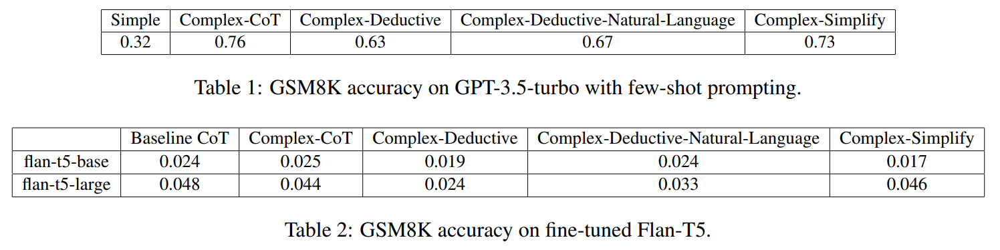

# transformers-for-mwp
## Prompting to Reason Deductively
### [Paper](prompting_to_reason_deductively.pdf)
### Abstract
This paper investigates the effectiveness of different prompting strategies in improving the mathematical reasoning abilities of large language models (LLMs) based on transformer architecture. We propose and evaluate various prompting strategies, including chainof-thought approaches. Experimental results demonstrate that more complex prompts do not necessarily lead to better performance and that the Complex-CoT strategy achieves the highest accuracy. The findings highlight the importance of prompt design in enhancing mathematical reasoning capabilities in LLMs.
### Results
<kbd>
    
</kbd>
